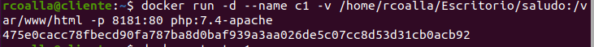
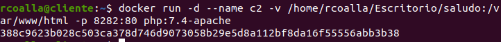
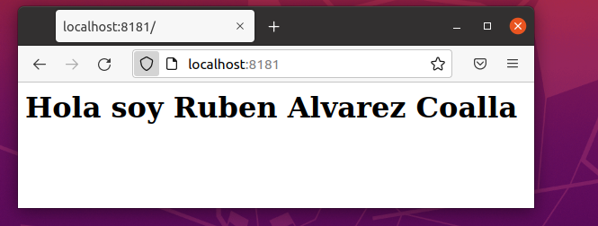
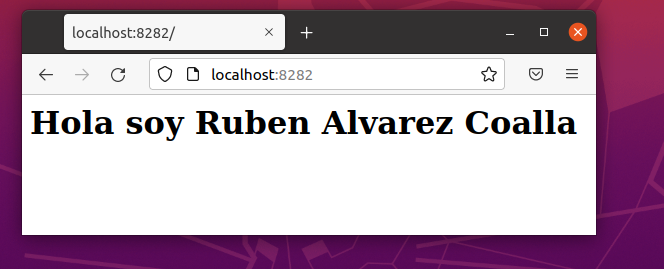
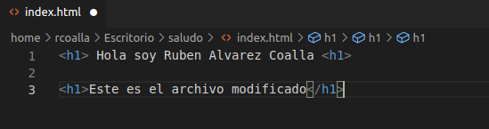
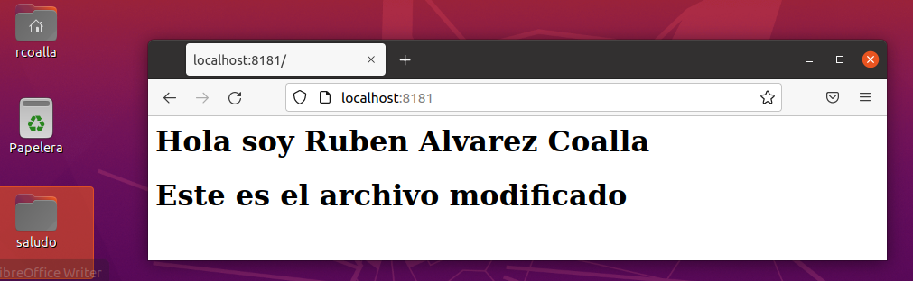
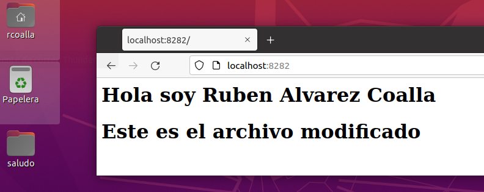
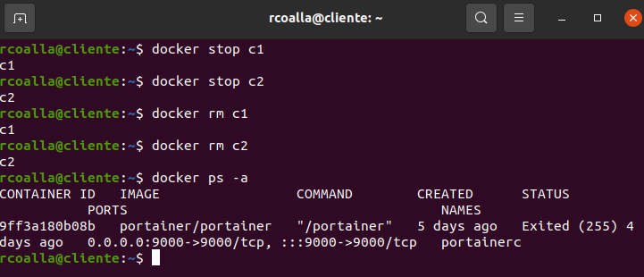

[TOC]

> # Ejercicio 2 - almacenamiento


## Bind mount para compartir datos

Crea una carpeta llamada `saludo` y dentro de ella crea un fichero llamado `index.html` con el
siguiente contenido (Deberás sustituir ese XXXXX por tu nombre.):

Una vez hecho esto arrancar dos contenedores basados en la imagen **php:7.4-apache** que hagan un
bind mount de la carpeta `saludo` en la carpeta `/var/www/html` del contenedor. Uno de ellos vamos
a acceder con el puerto 8181 y el otro con el 8282. Y su nombres serán `c1` y `c2` .

Modifica el contenido del fichero `~/saludo/index.html` .

Comprueba que puedes seguir accediendo a los contenedores, sin necesidad de reiniciarlos.
Borra los contenedores utilizados


#### 1. Pantallazo con la orden correspondiente para arrancar el contenedor `c1` (puerto 8181) realizando el bind mount solicitado

​	Creamos la carpeta en el escritorio y hacemos el bind mount

```bash
docker run -d --name c1 -v /home/rcoalla/Escritorio/saludo:/var/www/html -p 8181:80 php:7.4-apache
```





#### 2. Pantallazo con la orden correspondiente para arrancar el contenedor `c2` (puerto 8282) realizando el bind mount solicitado.


```bash
docker run -d --name c2 -v /home/rcoalla/Escritorio/saludo:/var/www/html -p 8282:80 php:7.4-apache
```





#### 3. Pantallazo donde se pueda apreciar que accediendo a `c1` se puede ver el contenido de `index.html` .





#### 4. Pantallazo donde se pueda apreciar que accediendo a `c2` se puede ver el contenido de `index.html` .





#### 5. Otros dos pantallazos donde se vea el acceso al fichero `index.html` después de modificarlo.

​	Modificamos el archivo:



y se modifica en los dos contenedores:








#### 6. Borrar los dos contenedores. Mostrar que se han borrado.

```bash
docker stop c1
docker stop c2
docker rm c1
docker rm c2
docker ps -a
```




